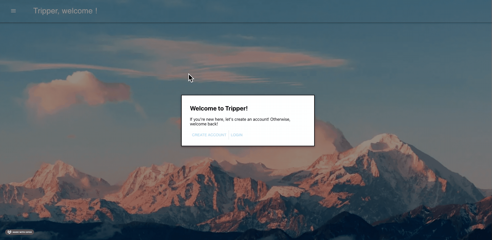
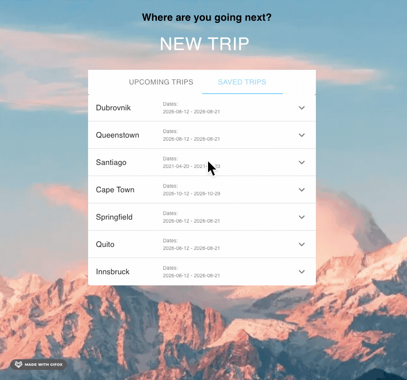
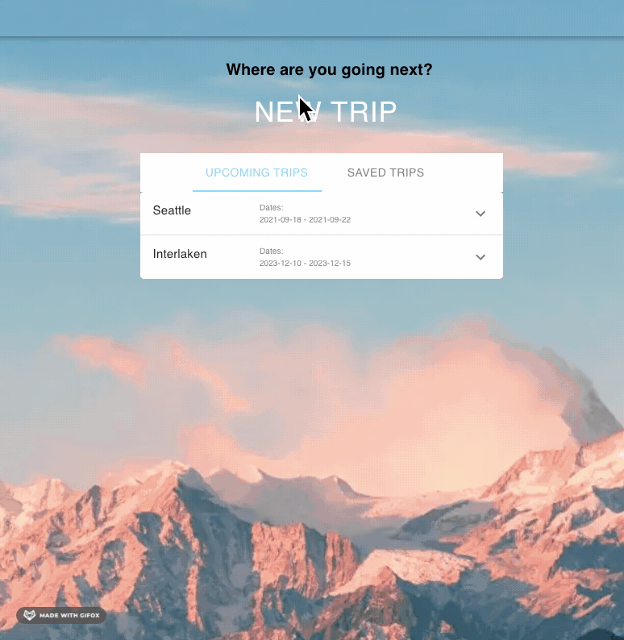
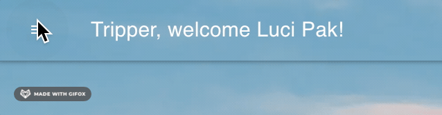

# Wallace Corporation

  

# Contributor

[Luci Pak](https://github.com/lucipak "Luci Pak")

# Introduction

Tripper Travel App is a fullstack application designed to be a travel planner and travel inspiration board attached to your own user account. The primary features include the ability to login or create a new account, create a new trip that fetches data from a travel API that consists of flights, hotels, and points of interests specific to the dates you set and your destination, and the ability to save, delete, or book these trips. 
This was a passion project for myself becuase I am always looking for my next trip and would love a one-stop shop to make all necessary plans in one place. 

# Tech Stack
<ul>
<li>GraphQL</li>
<li>Express</li>
<li>Node.js</li>
<li>Apollo Server/Client</li>
<li>Javascript</li>
<li>PostgreSQL</li>
<li>CSS</li>
<li>Bootstrap icons</li>
</ul>

# Technical Challenges and Research

# User Stories
<ul>
<li>As a user, I want to be able to login to my account or create a new account if I'm new to the site</li>
<li>As a user, I want to be able to logout back to the landing page</li>
<li>As a user, I want to be able to see all my upcoming trips and my saved trips</li>
<li>As a user, I want to be able to book my saved trips</li>
<li>As a user, I want to be able to delete a saved trip or unbook an upcoming trip</li>
<li>As a user, I want to be able create a new trip based on a destination of my choosing and choose which dates I would like to travel</li>
</ul>

# What's next?
<ul>
<li>The ability to input more user data tagged to their account</li>
<li>Use third party authentication</li>
<li>Be able to actually book trips</li>
<li>Transition into a mobile app</li>
</ul>

# How does the app work?
Login:
 

Saved and Book Trip Cards:
 

New Trip Stepper:
 

Logout:
 

